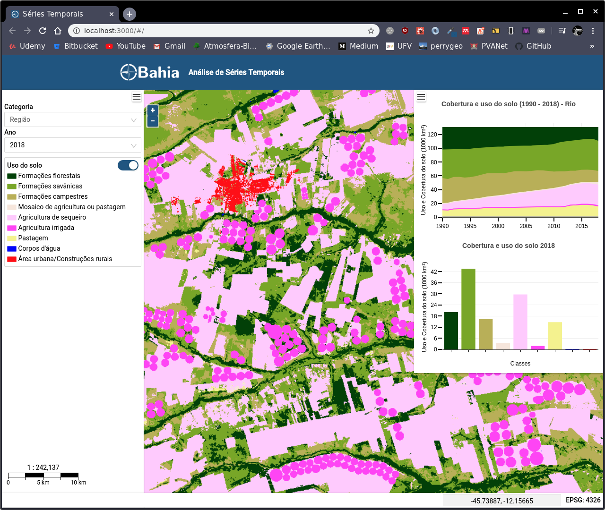

<h1>OBahia - Intelligent Territorial Strategy System</h1>
<h2>Time Series Analysis</h2>
 

 
 

  

  

  

### Termos de uso

O usuário assume todo o risco relacionado ao uso de informações nas páginas Web deste servidor. A UFV fornece essas informações "como estão", e a UFV se isenta de todas e quaisquer garantias, expressas ou implícitas, incluindo (mas não se limitando a) quaisquer garantias implícitas de adequação a uma finalidade específica. Em nenhum caso a UFV será responsável perante usuários ou terceiros por quaisquer danos diretos, indiretos, incidentais, conseqüenciais, especiais ou perda de lucro resultante de qualquer uso ou uso indevido desses dados.

Developed by Fernando Pimenta [My Github!](https://github.com/pimentafm) :bird: :sunglasses:

